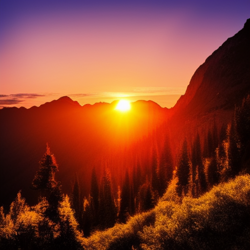

# Jarvis AI Image Generation Module

<div align="center">

# Jarvis AI Image Generation Showcase

## Sample Generations

<div align="center">


</div>

## LoRA Fine-tuned Generations

These images showcase the capabilities of our LoRA-fine-tuned model, demonstrating its ability to generate diverse artistic styles and compositions. The model has been trained to understand and reproduce various artistic elements while maintaining high quality and coherence in the generated images.

**A powerful image generation system with state-of-the-art diffusion models, fine-tuning capabilities, and high-quality output.**

</div>

## 🌟 Overview

The Image Generation module of Jarvis AI Assistant implements cutting-edge diffusion models and GANs to create high-quality images from text descriptions. The system features advanced fine-tuning capabilities, allowing for personalization and customization of the generated images.

### Key Features

- **Text-to-Image Generation**: Create detailed images from text prompts
- **Multiple Fine-tuning Methods**: Support for DreamBooth, LoRA, and Textual Inversion
- **Memory-Efficient Processing**: Optimized for performance on consumer hardware
- **High-Quality Output**: Generate detailed, high-resolution images
- **Customization Options**: Extensive parameters for controlling the generation process

## 🖼️ Sample Generated Images

<div align="center">

| Image                                                                                                                                                                   | Prompt                                                                                           |
| ----------------------------------------------------------------------------------------------------------------------------------------------------------------------- | ------------------------------------------------------------------------------------------------ |
|                                                                                                  | "A beautiful sunset over mountains"                                                              |
|                                                                                         | "A photo of an astronaut riding a horse on Mars"                                                 |
|  | "A golden dog" |
|                                                                                   | "a black and white photo of a horse"                                                             |

</div>

## 🏗️ Technical Architecture

The image generation component uses a state-of-the-art diffusion model architecture:

### Diffusion Model Components

- **U-Net Backbone**: The core denoising network with residual blocks, attention layers, and skip connections

  - Processes noisy images at multiple resolutions
  - Gradually removes noise in a controlled manner
  - Incorporates conditioning information from text

- **Cross-Attention Mechanism**:

  - Connects text embeddings to the image generation process
  - Allows the model to focus on relevant parts of the text embedding at each denoising step
  - Enables fine-grained control over image generation through text prompts

- **CLIP Text Encoder**:

  - Processes text prompts into rich embeddings
  - Trained on millions of image-text pairs
  - Creates a semantic bridge between language and visual concepts

- **Diffusion Process**:
  - Forward process: Gradually adds Gaussian noise to images
  - Reverse process: Learns to denoise images step by step
  - Sampling: Starts from pure noise and iteratively refines into coherent images

### Memory Optimization Techniques

- **Gradient Checkpointing**: Reduces memory usage by recomputing intermediate activations during backpropagation
- **Mixed Precision Training**: Uses FP16 where possible to reduce memory footprint
- **Efficient Attention Implementation**: Optimized attention mechanisms to reduce memory requirements
- **Progressive Loading**: Processes images in chunks to handle limited GPU memory

## 🚀 Getting Started

### Prerequisites

- Python 3.8 or higher
- CUDA-compatible GPU with 8GB+ VRAM (16GB+ recommended for fine-tuning)
- 16GB+ RAM

### Installation

1. Clone the repository:

   ```bash
   git clone https://github.com/yourusername/Jarvis-AI-Assistant.git
   cd Jarvis-AI-Assistant
   ```

2. Install dependencies:

   ```bash
   pip install -r requirements.txt
   ```

3. Download model checkpoints:

   ```bash
   # Create checkpoints directory if it doesn't exist
   mkdir -p checkpoints

   # Download the model checkpoint
   wget -O checkpoints/v1-5-pruned-emaonly.ckpt https://huggingface.co/runwayml/stable-diffusion-v1-5/resolve/main/v1-5-pruned-emaonly.ckpt
   ```

## 💻 Usage

### Basic Image Generation

Generate images from text prompts:

```bash
python run_text2image.py --prompt "A beautiful sunset over mountains" --steps 50 --cfg-scale 7.5
```

Options:

- `--prompt`: Text description of the image to generate
- `--negative-prompt`: Things to exclude from the image
- `--steps`: Number of denoising steps (higher = better quality but slower)
- `--cfg-scale`: How closely the image follows the prompt (higher = more faithful)
- `--seed`: Random seed for reproducibility
- `--sampler`: Sampling method (ddpm, ddim, etc.)

### Memory-Efficient Generation

For systems with limited GPU memory:

```bash
python scripts/test_memory_efficient.py --prompt "A beautiful sunset over mountains" --memory-efficient
```

## 🧠 Fine-tuning Capabilities

The system supports multiple fine-tuning approaches to customize the model for specific styles, concepts, or subjects.

### 1. Custom Fine-Tuning

General fine-tuning on a dataset of images with corresponding prompts:

```bash
python scripts/finetune_example.py \
  --mode custom \
  --image_dir path/to/images \
  --prompt_file path/to/prompts.txt \
  --output_dir checkpoints/custom_finetuned \
  --learning_rate 1e-6 \
  --epochs 1 \
  --batch_size 1 \
  --gradient_accumulation_steps 4 \
  --mixed_precision
```

### 2. DreamBooth Fine-Tuning

DreamBooth is a technique that allows you to personalize text-to-image diffusion models with your own subjects. By training on just a few images of a subject, the model learns to generate new images of that subject in different contexts while preserving its key features.

```bash
python scripts/finetune_example.py \
  --mode dreambooth \
  --image_dir path/to/subject_images \
  --class_name "dog" \
  --identifier "sks" \
  --output_dir checkpoints/dreambooth_finetuned \
  --learning_rate 5e-7 \
  --epochs 1 \
  --batch_size 1 \
  --gradient_accumulation_steps 4 \
  --mixed_precision
```

After training, you can generate images of your subject using the prompt "a photo of sks dog" (replacing "dog" with your class name).

#### DreamBooth Technical Details

- **Subject-Specific Learning**: Uses a unique identifier to teach the model a specific subject
- **Class-Preservation Loss**: Prevents language drift by using class images during training
- **Prior-Preservation Loss**: Maintains the model's prior knowledge while learning new concepts
- **Regularization Images**: Prevents overfitting to the specific subject

### 3. LoRA (Low-Rank Adaptation) Fine-Tuning

LoRA is a parameter-efficient fine-tuning technique that adds small, trainable rank decomposition matrices to existing weights:

```bash
python fine_tuning/lora/train_lora.py \
  --pretrained_model_name_or_path "runwayml/stable-diffusion-v1-5" \
  --dataset_name "path/to/dataset" \
  --output_dir "lora_output" \
  --resolution 512 \
  --train_batch_size 1 \
  --gradient_accumulation_steps 4 \
  --learning_rate 1e-4 \
  --max_train_steps 1000
```

#### LoRA Technical Details

- **Low-Rank Decomposition**: Represents weight updates as low-rank matrices (typically rank 4-16)
- **Parameter Efficiency**: Requires training only ~1% of the original model parameters
- **Memory Efficiency**: Significantly reduces memory requirements during training
- **Adaptability**: Can be applied to specific layers or the entire model
- **Composability**: Multiple LoRA adaptations can be combined for different effects

### 4. Textual Inversion

Textual Inversion learns a new concept or style while primarily updating the text encoder:

```bash
python scripts/finetune_example.py \
  --mode textual_inversion \
  --image_dir path/to/style_images \
  --concept_name "watercolor_style" \
  --output_dir checkpoints/textual_inversion_finetuned \
  --learning_rate 1e-5 \
  --epochs 1 \
  --batch_size 1 \
  --gradient_accumulation_steps 4 \
  --mixed_precision
```

#### Textual Inversion Technical Details

- **New Token Learning**: Introduces new tokens to the text encoder vocabulary
- **Embedding Optimization**: Optimizes embeddings while keeping model weights frozen
- **Style Transfer**: Particularly effective for learning artistic styles
- **Concept Encoding**: Can encode abstract concepts with just 3-5 example images

## 🔧 Memory Optimization

Fine-tuning Stable Diffusion requires significant GPU memory. The scripts include several memory optimization techniques:

1. **Gradient Accumulation**: Updates weights after accumulating gradients from multiple batches
2. **Mixed Precision Training**: Uses lower precision (FP16) where possible
3. **Selective Layer Training**: Option to train only specific components (UNet, text encoder, etc.)

If you encounter out-of-memory errors, try:

- Reducing batch size to 1
- Increasing gradient accumulation steps
- Enabling mixed precision training
- Using the `--train_unet_only` option

## 📚 Technical Deep Dive

### Stable Diffusion Architecture

Stable Diffusion is a latent diffusion model that operates in a compressed latent space rather than pixel space:

1. **VAE Encoder**: Compresses images to a lower-dimensional latent space
2. **Diffusion in Latent Space**: Performs the diffusion process in this compressed space
3. **U-Net Denoiser**: Predicts noise in the latent space at each diffusion step
4. **VAE Decoder**: Decodes the final latent representation back to pixel space

#### Diffusion Process Details

1. **Forward Process (Training)**:

   - Gradually adds Gaussian noise to latent representations
   - Creates a sequence of increasingly noisy latents
   - Noise schedule controls the rate of noise addition

2. **Reverse Process (Sampling)**:

   - Starts from pure Gaussian noise
   - Iteratively denoises using the U-Net
   - Conditioning from text guides the denoising process
   - Each step refines the latent representation

3. **Conditioning Mechanisms**:
   - Cross-attention layers connect text embeddings to the denoising process
   - Classifier-free guidance controls adherence to the text prompt
   - Unconditional guidance helps with image quality

### Sampling Methods

- **DDPM**: Original diffusion sampling, high quality but slow (100+ steps)
- **DDIM**: Deterministic sampling that allows for fewer steps (20-50)
- **PLMS**: Pseudo Linear Multistep method for faster sampling
- **Euler a**: Euler ancestral sampling, good quality/speed tradeoff
- **DPM-Solver++**: Advanced ODE solver for very fast sampling (10-20 steps)

## 📊 Fine-Tuning Tips

1. **Image Quality**: Use high-quality, consistent images for training
2. **Training Duration**: More epochs generally give better results, but watch for overfitting
3. **Learning Rate**: Start with a small learning rate (1e-6 to 1e-7) to avoid destroying pre-trained knowledge
4. **Prompt Engineering**: For DreamBooth, choose a unique identifier that doesn't conflict with existing concepts
5. **Regularization**: For longer training, consider using regularization images to prevent overfitting
6. **Dataset Size**: Even small datasets (10-20 images) can yield good results with proper hyperparameters
7. **Image Diversity**: Include varied poses, lighting, and backgrounds for better generalization
8. **Batch Size**: Smaller batch sizes with gradient accumulation often work better than large batches

## 🛠️ Troubleshooting

- **Out of Memory Errors**: Reduce batch size, increase gradient accumulation steps, or enable mixed precision
- **Poor Quality Results**: Try more training images, longer training, or adjusting the learning rate
- **Slow Training**: Consider using a more powerful GPU or reducing the model size
- **Subject Forgetting**: Increase regularization images or reduce learning rate
- **Overfitting**: Reduce training epochs or increase regularization

## 📚 Learning Resources

- [Stable Diffusion Paper](https://arxiv.org/abs/2112.10752)
- [DreamBooth Paper](https://arxiv.org/abs/2208.12242)
- [LoRA Paper](https://arxiv.org/abs/2106.09685)
- [Textual Inversion Paper](https://arxiv.org/abs/2208.01618)
- [Diffusion Models Tutorial](https://lilianweng.github.io/posts/2021-07-11-diffusion-models/)
- [Hugging Face Diffusers Library](https://huggingface.co/docs/diffusers/)
- [GAN Tutorial Series](https://youtube.com/playlist?list=PLhhyoLH6IjfwIp8bZnzX8QR30TRcHO8Va&si=jaXWgJt3pcnV2o5c) (videos 1-5)

## 👏 Acknowledgements

- **Lead Developer**: Amr
- [PyTorch](https://pytorch.org/) for the deep learning framework
- [Hugging Face](https://huggingface.co/) for transformer models and tools
- [LAION](https://laion.ai/) for datasets and research
- [Stability AI](https://stability.ai/) for the Stable Diffusion model
